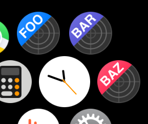

# ribboned

Make default app icons identifiable (for iOS, macOS, and watchOS)




## Usage
```
ribboned [FLAGS] <APPICONSET> <TEXT>

FLAGS:
        --ios        Generate icons for iOS
        --mac        Generate icons for macOS
        --watch      Generate icons for watchOS

ARGS:
    <APPICONSET>    Path to .appiconset (e.g. /path/to/Assets.xcassets/AppIcon.appiconset)
    <TEXT>          Icon text (Up to three characters will be displayed)
```

### Example
```
ribboned ~/Project/Shared/Assets.xcassets/AppIcon.appiconset RIBBONED --ios --mac
```
↓


## Install
```
cargo install ribboned
```

## Requirements
* Helvetica is installed (Characters not included in Helvetica may not be rendered beautifully)
